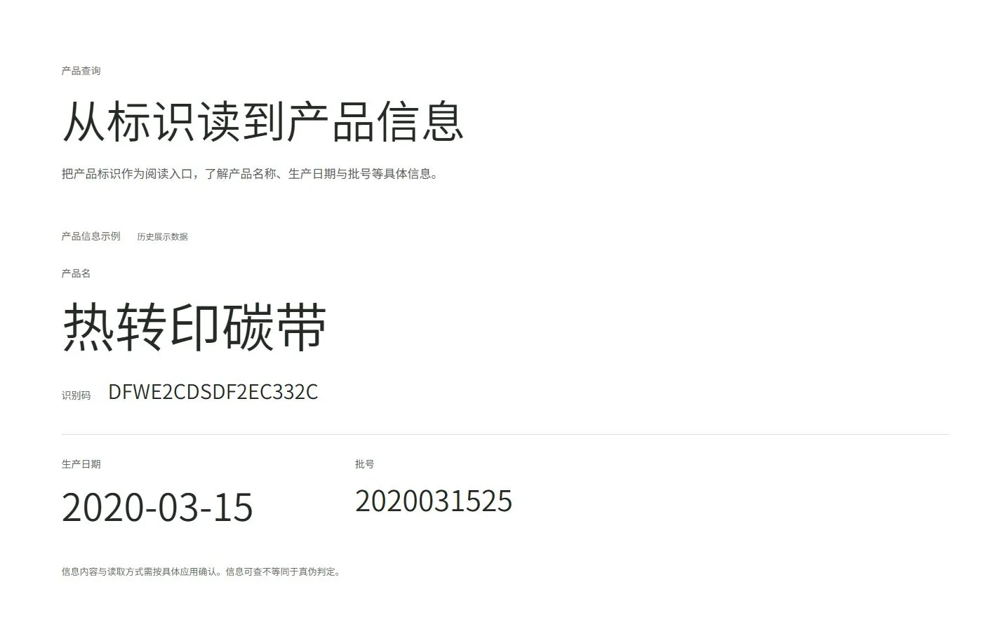
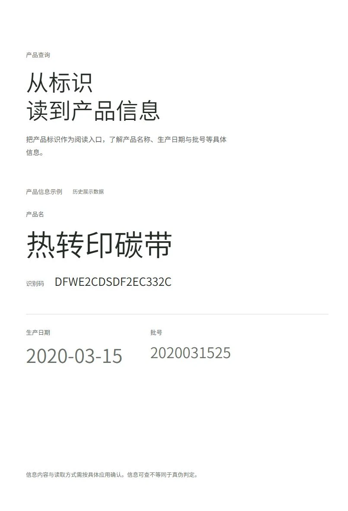
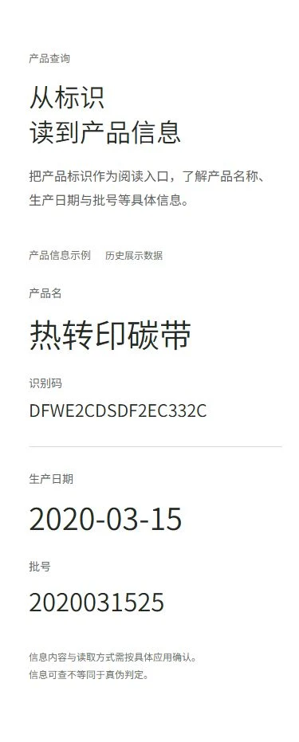

# Phase 2D-A8-B Review Manifest

Status: PHASE_2D_A8_B_REVIEW_READY. Prototype copy awaits Product Owner approval.

## Product Owner — LOCAL_INTERACTIVE_TESTED

Open [current complete prototype](http://127.0.0.1:8767/) and scroll through C2→C3→C4. [Direct C4 entry](http://127.0.0.1:8767/#product-information) is convenient for the information field. Desktop attention shifts subtly; mobile stays naturally readable. Local URLs work while this workstation's servers remain running.

Download the [complete website ZIP](http://127.0.0.1:8768/Tusky-A8-B-Full-Web.zip), `Tusky-A8-B-Full-Web.zip` (6,393,081 bytes; 19 entries). Extract anywhere and run `python preview.py`; open http://127.0.0.1:8769/ . Python 3 is required only for the portable localhost server. The package includes complete C1–C4 code, runtime and approved source media, fonts, font license, preview instructions and asset hashes. This extracted package was tested independently outside the original project directory.

## ChatGPT — REMOTE_STATIC_REVIEW + recorded motion

Use [Delta Review ZIP](http://127.0.0.1:8768/Tusky-A8-B-Delta-Review.zip), `Tusky-A8-B-Delta-Review.zip`. It contains this phase's complete changed HTML, new scoped CSS/JS/font, exact HTML diff, these four B documents, compressed screenshots, viewport/no-JS/independent-package measurements and one desktop WebM. The changed HTML references unchanged assets that intentionally are not in the delta; it is a source/evidence package, not a standalone website. Use the separate Full-Web ZIP for interactive review. No unchanged historical images or A8-A documents are repackaged in the delta.

### Primary visual evidence

- [C2→C3→C4 long-page view](evidence/1440x900-c2-c3-c4.webp): single full-page capture crop beginning at C2's rendered final stage.
- [Desktop reading motion, 7.1s WebM](evidence/1440x900-c4-reading.webm): actual scroll capture, VP8 1280×812, 171,043 bytes. No changing or simulated server values.
- Additional complete C4 screenshots: `1024x900-c4-whole.webp`, `430x932-c4-whole.webp`, `320x740-c4-whole.webp`.
- No-JS screenshots: `1440x900-no-js-c4.webp`, `390x844-no-js-c4.webp`.
- Measurements: `viewport-measurements.json`, `no-js-measurements.json`, `independent-package-measurements.json`, `package-source-checks.json`.

Whole-chapter crops can exceed one viewport; they are not claims of fitting mobile content into one screen. Screenshot content excludes the browser's 15px scrollbar. The phase keeps the accepted C2 scroll behavior; its preceding unchanged sticky rail is not a new C4 layout gap.

### Source and documents

Repository-relative implementation paths:

- `prototypes/phase-2d-a5-3/tusky_phoenix/index.html` — C4 section and two resource references only.
- `prototypes/phase-2d-a5-3/tusky_phoenix/assets/tusky_phoenix_reading.css` — scoped open field, responsive composition and preference-gated emphasis.
- `prototypes/phase-2d-a5-3/tusky_phoenix/assets/tusky_phoenix_reading.js` — presentation-only attention state.
- `prototypes/phase-2d-a5-3/tusky_phoenix/assets/fonts/noto-sans-sc-reading.woff2` — variable subset for the new text; existing OFL license in Full-Web.

Review these documents together: [Implementation QA](Tusky-Chapter-4-Implementation-QA.md), [Responsive QA](Tusky-Chapter-4-Responsive-QA.md), [B Decision](Phase-2D-A8-B-Decision.md), and this manifest. Exact HTML diff is `evidence/phase-2d-a8-b.patch`.

Verification boundary: six real browser sizes; actual no-JS desktop/mobile; independent extracted-package HTTP assets and browser checks. Reduced-motion CSS/preference transitions are INSPECTED/SIMULATED, not actual OS preference verification. No production query capability, physical hardware or cross-engine validation is claimed. GitHub source URLs are not interactive/motion evidence.

Git: main at `80b4a79e5d96163185081e193b37c06ce8bfa550`, fresh Ahead 0 / Behind 0. Working tree contains retained A8-A and new B changes. No commit or push. No C5.
