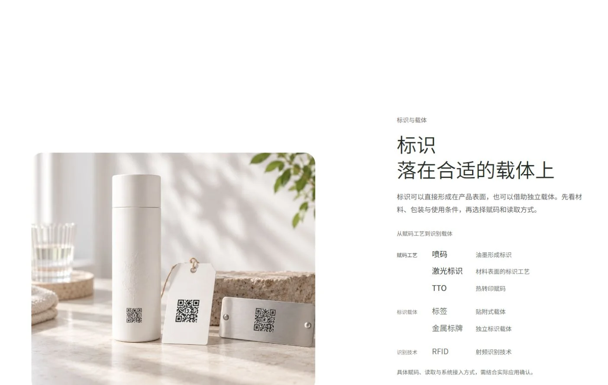
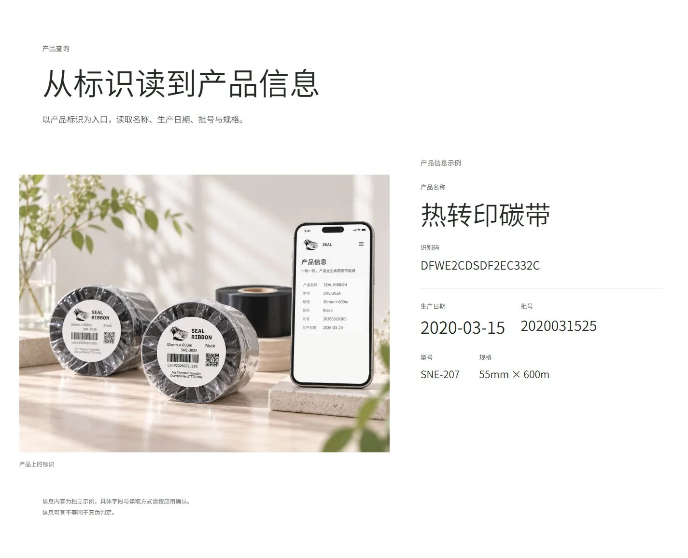
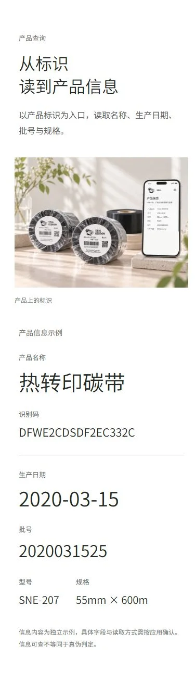

# Phase 2D-A8-C Patch 01 Review Manifest

状态：PHASE_2D_A8_C_P01_REVIEW_READY。等待 PO 接受；A8-C NOT ACCEPTED。本 manifest 替代旧 A8-C 同名清单，旧版证据与结论保留于历史 ZIP，不代表当前已接受。

## 本机交互预览

[打开当前完整页面](http://127.0.0.1:8767/)；从 C2 自然滚动至 C3/C4，观察进入时机与页面节奏。直接跳到锚点只能辅助检查布局，不能替代自然进入的动画评审。服务仅在本机运行期间可用。

## 增量评审包

[下载 Tusky-A8-C-Patch-01-Delta-Review.zip](http://127.0.0.1:8768/Tusky-A8-C-Patch-01-Delta-Review.zip)

本次按用户明确要求仅提供 Delta，不重打包未变媒体或新的 Full-Web。Delta 包含五个改变的运行文件、下列五份当前文档、精选截图、QA JSON、三段 WebM、文本 diff。字体文件属于本次改变的子集；既有 PNG/WebP、字体许可和前章资产不重复放入。

Delta 不能独立运行。需要在已有 `Tusky-A8-C-Full-Web.zip` 的解压副本上，将本包 `prototypes/phase-2d-a5-3/tusky_phoenix/` 下五个文件覆盖到完整包根目录的对应位置；然后按该包 README 启动 localhost。A8-C Full-Web 只是技术基底，不是接受结果。当前项目中的 8767 页面已直接包含本补丁。

## 必看截图与动态证据

- [C2→C3→C4 连续长页](evidence-a8c-p01/1440x900-c2-c3-c4.webp)
- [C3 Desktop WebM](evidence-a8c-p01/c3-desktop.webm)
- [C4 Desktop WebM](evidence-a8c-p01/c4-desktop.webm)
- [C4 Mobile WebM](evidence-a8c-p01/c4-mobile.webm)

三段录像均约 7.2 秒，为本补丁实际滚动采集。包中另含六个规定尺寸与 820×700 横屏截图、C3 新起／终点和 C4 交接状态，以及 1440 / 390 静态降级画面。截图尺寸命名指测试视口；完整章节可高于视口。

## 改变的运行文件

路径均相对于仓库 `D:\Project\SealIntelligence.Web`：

1. `prototypes/phase-2d-a5-3/tusky_phoenix/index.html` — C4 单一故事、语义字段、共同媒体变换层。
2. `prototypes/phase-2d-a5-3/tusky_phoenix/assets/tusky_phoenix_carriers_motion.css` — 桌面／横屏圆角。
3. `prototypes/phase-2d-a5-3/tusky_phoenix/assets/tusky_phoenix_reading.js` — 分章感知窗口、短章节自然收束。
4. `prototypes/phase-2d-a5-3/tusky_phoenix/assets/tusky_phoenix_reading.css` — C4 层级与桌面／手机交接。
5. `prototypes/phase-2d-a5-3/tusky_phoenix/assets/fonts/noto-sans-sc-reading.woff2` — 本次文案字形。

## 五份文档与检查依据

- [Patch 01 决策与交接](Phase-2D-A8-C-Patch-01.md)
- [C3 Motion QA](Tusky-Chapter-3-Motion-QA.md)
- [C4 Implementation QA](Tusky-Chapter-4-Implementation-QA.md)
- [C4 Motion QA](Tusky-Chapter-4-Motion-QA.md)
- 本 REVIEW-MANIFEST

源文件差异：`evidence-a8c-p01/phase-2d-a8-c-p01.patch`。保护检查与 SHA256：`source-checks.json`。真实尺寸／时机／录像／降级记录均位于 `evidence-a8c-p01/`，没有拿历史截图替代本补丁结果。

## 验证边界与 Git

LOCAL_INTERACTIVE_TESTED：六个规定尺寸及额外横屏、no-JS 静态页面、实际滚动录像。REMOTE_STATIC_REVIEW：source、diff、截图、QA、WebM；GitHub 源码 URL 不是交互网站。

减少动态效果用测试响应实际渲染静态分支，另有 VM 的偏好切换检查；真实 OS 设置切换 NOT_VERIFIED。没有生产查询、真实性验证、硬件工艺或公开部署的证据升级。概念手机和独立示例值不能被当作同一实际查询记录。

分支 main，HEAD `80b4a79e5d96163185081e193b37c06ce8bfa550`。fresh Ahead 0 / Behind 0，工作区保留未提交改动；没有 commit，尚未推送。Hero、C2 与批准媒体保持原样。停止在本补丁，不进入 C5。
